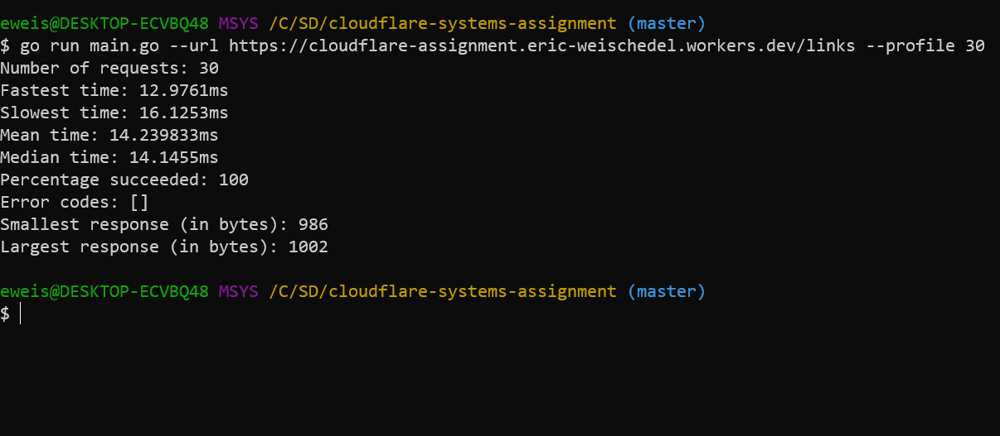

# HTTP Client

A CLI to make HTTP requests to a given endpoint and profile the server's performance.

## Running

1. Install [Go](https://golang.org/doc/install)

2. Run the program:

```
go run main.go <options>
```

## Options

| Flag        | Argument? | Description                              |
| ----------- | --------- | ---------------------------------------- |
| `--help`    |           | Shows help text                          |
| `--url`     | string    | Specifies the URL to send the request to |
| `--profile` | int       | Specifies the number of requests to make |

## Example



## Testing Popular Sites

I ran this tool against several websites, running 30 requests for each one. The results are sorted by median time ascending.

| Site               | Median Time | Fastest Time | Slowest Time |
| ------------------ | ----------- | ------------ | ------------ |
| Facebook           | 14.5307ms   | 13.5735ms    | 34.9535ms    |
| YouTube            | 15.0018ms   | 13.753ms     | 26.0276ms    |
| My Cloudflare Site | 15.0053ms   | 12.9756ms    | 31.0085ms    |
| Wikipedia          | 19.4612ms   | 18.2984ms    | 31.115ms     |
| Reddit             | 20.9602ms   | 19.6843ms    | 30.7786ms    |

According to these results, my Cloudflare site's response time is competitive with Facebook and YouTube. The median response time is within half a millisecond and the fastest time is the fastest out of all the measurements.
